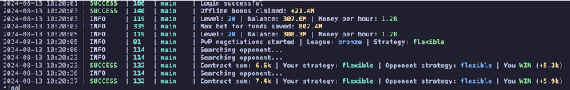

[](https://t.me/hidden_coding)

[](https://t.me/hidden_codding_chat)

[](https://t.me/notpixel_bot)

# Бот для [Notpixel Bot](https://t.me/notpixel_bot)



# Основные возможности

1. Выполняет автоматизированные задачи (таски).

## Функционал

| Функция                               | Поддерживается |
|---------------------------------------|:--------------:|
| Многопоточность                       |       ✅        |
| Привязка прокси к сессии              |       ✅        |
| Задержка перед запуском каждой сессии |       ✅        |
| Выполнение задач                      |       ✅        |
| Получение наград                      |       ✅        |
| Автоматическая обработка событий      |       ✅        |
| Docker                                |       ✅        |

## Настройки

| Опция                   | Описание                                                                        |
|-------------------------|---------------------------------------------------------------------------------|
| **API_ID / API_HASH**   | Данные платформы для запуска сессии Telegram                                    |
| **SLEEP_BETWEEN_START** | Задержка перед запуском каждой сессии дефолт [20, 360]                          |
| **ERRORS_BEFORE_STOP**  | Количество неудачных запросов, по достижению которых, бот остановится  дефолт 3 |
| **USE_PROXY_FROM_FILE** | Использовать-ли прокси из файла proxies.txt дефолт False Тrue                   |
| **RANDOM_SLEEP_TIME**   | Время сна после завершения всех действий бота дефолт [1300, 1700]               |

## Быстрый старт 📚

Для быстрой установки и последующего запуска - запустите файл run.bat на Windows или run.sh на Линукс

## Предварительные условия

Прежде чем начать, убедитесь, что у вас установлено следующее:

- [Python](https://www.python.org/downloads/) **версии 3.10**

## Получение API ключей

1. Перейдите на сайт [my.telegram.org](https://my.telegram.org) и войдите в систему, используя свой номер телефона.
2. Выберите **"API development tools"** и заполните форму для регистрации нового приложения.
3. Запишите API_ID и API_HASH в файле .env, предоставленные после регистрации вашего приложения.

## Установка

Вы можете скачать [**Репозиторий**](https://github.com/paveL1boyko/NotpixelBot.git) клонированием на вашу систему и
установкой необходимых зависимостей:

```bash
git clone https://github.com/paveL1boyko/NotpixelBot.git

```
¬
# Windows

1. Запустить файл `INSTALL.bat` для установки зависимостей
2. Добавить в `.env` файл переменные окружения `API_HASH` и `API_HASH`
    1. Если нужно создать сесси или скопировать с другого бота
3. Запустить файл `RUN.bat` для запуска ботов

# Linux

1. Запустить файл `INSTALL.sh` для установки зависимостей
2. Добавить в `.env` файл переменные окружения `API_HASH` и `API_HASH`
    1. Если нужно создать сесси или скопировать с другого бота
3. Запустить файл `RUN.sh` для запуска ботов
